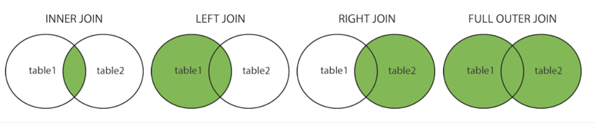
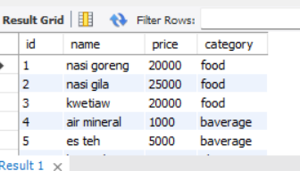

# Week 6 Writing test

## Day 1 (31/10/2022)

### MySQL

Database merupakan sekumpulan informasi yang disimpan didalam komputer secara sistematik dan saling berelasi,didalam pembuatan database diperlukan DBMS (Database Management System), Nahh dbms sendiri merupakan softaware untuk berkomunikasi antara data yang ada di database,adapun istilah di database yang harus diketahui adalah

1.  **TABEL**
    merupakan kumpulan value yang didalamnya berisikan atribut dari sebuah data.

2.  **FIELD**
    merupakan sebuah tabel dimana masing-masing field memiliki tipe data masing-masing contohnya adalah tabel user memiliki field nama dengan tipe data varchar(50)

3.  **SQL**
    SQL atau structured query languange merupakan suatu bahasa (languange) yang digunakan untuk mengakses database termasuk digunakan untuk berinteraksi dengan RDMS (Relation database management system),fungsi dari sql ini dapat melakukan CRUD dalam sebuah database

4.  **Relational database** Adapun di dalam database nantinya terdapat relational database yang berfungsi untuk menghubungkan antara satu tabel dengan tabel lainnya adapun jenis relational database sebagai berikut ini :

    1. _One to one_
       contoh one to one adalah tabel customer dengan kartu pelanggan,jadi 1 customer hanya bisa memiliki 1 kartu pelanggan,dan juga 1 kartu pelanggan hanya bisa di miliki 1 customer
    2. _One to many_
       Contoh dari one to many adalah tabel ruang kelas dengan siswa, jadi 1 ruang kelas bisa memiliki banyak(many) siswa,sedangkan satu siswa hanya bisa memiliki 1 kelas
    3. _many to one_
       Contoh many to one adalah antara tabel order dengan customer,dimana 1 order hanya bisa dimiliki oleh 1 customer,sedangkan 1 customer bisa memiliki banyak(many) orderan.
    4. _many to many_
       Contoh many to many adalah tabel mahasiswa dan tabel mata_kuliah,dimana 1 mahasiswa dapat memiliki banyak(many) mata_kuliah,dan 1 mata_kuliah dapat memiliki banyak(many) mahasiswa.

5.  **Tipe data pada SQL**
    Tipe data berfungsi untuk menyatakan nilai sebuah variabel,sebenarnya banyak sekali tipe data tapi disini saya hanya menjelaskan tipe data yang sering dipakai dan yang sudah dijelaskan pada sesi kelas

    **Tipe data Numeric**

    > - INT
    >   > - Berfungsi untuk menyimpan data bilangun bulan positif dan negatif
    >   > - 4 byte (32 bit)
    >   > - -2.147.483.648 s/d 2.147.483.647
    >   > - contoh : -4,5,7,100
    > - FLOAT
    >   > - Berfungsi menyimpan data bilangan pecahan positif dan negatif presisi tunggal
    >   > - -3.402823466E+38 s/d -1.175494351E-38, 0, dan 1.175494351E-38 s/d 3.402823466E+38.
    >   > - 4 byte (32 bit)
    >   > - contoh : 3.5;8.9;-0.34
    > - DECIMAL
    >   > - Berfungsi menyimpan data bilangan pecahan positif dan negatif.
    >   > - -1.79…E+308 s/d -2.22…E-308, 0, dan 2.22…E-308 s/d 1.79…E+308.
    >   > - 8 byte (64 bit).
    >   > - Contoh : -62.3 ; -12.0 ; -812.12 ;8112.21

    **Tipe data string (text)**

    > - CHAR
    >   > - menyimpan data string ukuran tetap.
    >   > - 0 s/d 255 karakter
    > - VARCHAR
    >   > - menyimpan data string ukuran dinamis.
    >   > - 0 s/d 255 karakter (versi 4.1), 0 s/d 65.535
    > - TEXT - menyimpan data text. - 0 s/d 65.535

    **Tipe data date dan time**

    > - DATE
    >   > - menyimpan data tanggal
    >   > - Contoh : 2002-08-30 dsbnya
    > - TIME
    >   > - menyimpan data waktu
    >   > - Contoh : 8:26:45
    > - DATETIME
    >   > - Menyimpan data tanggal dan waktu
    >   > - Contoh : 2022-01-1 05:39:45
    >   > - YEAR - Menyimpan data tahun dari tanggal - Contoh : 2022

    **Tipe data lainnya**

    > - ENUM
    >   > - enumerasi (kumpulan data).
    >   > - sampai dengan 65535 string.
    >   > - Berisi data jurusan/gender/fakultas dsbya,contoh : enum('Ilmu Komputer','Sistem informasi','Data Science','Teknlogi Informasi')
    > - SET
    >   > - combination (himpunan data).
    >   > - sampai dengan 255 string anggota
    >   > - Perbedaan dengan enum adalah,set mampu memilih satu atau lebih nilai yang tersedia
    >   > - Adapun data dapat berisi hobi/kegiatan/Matkul dsbnya ,Contoh : set('Membaca','Menulis','Menggambar','Main Musik')

Pada project ini kita dapat membuat database menggunakan Mysql,adapun link dowloadnya sebagai berikut : [Link download sql](https://www.mysql.com/downloads/) dan untuk memudahkan mendowload dapat melihat [Link Panduan](https://pendragon.netlify.app/mysql-installation#instalasi-mysql-pada-windows),adapun basic querynya sebagai berikut :

1. create database [nama database]; ,Berfungsi untuk membuat database
2. use [database name]; ,berfungsi untuk masuk ke database yang baru saja kita buat
3. create table [nama_tabel] (
   id int primary key not null auto_increment,
   name varchar(25)
   );

   Berfungsi untuk membuat tabel pada sebuah database,adapun hal-hal yang harus diperhatikan adalah sebagai berikut

   - Setiap tabel diharuskan ada primary key dan harus not null,serta untuk memudahkan membuat Primary key dapat menggunakan fungsi auto_increment dimana id tersebut auto terbuat pada saat kita menambahkan data
   - jika menggunakan varchar/char tentukanlah panjangnya dengan menamba angka dibelakangnya varchar(30)

4. insert into [nama_tabel] (nama_atribut) values
   ("food"),
   ("baverage"),
   ("ala carte")
   ;

   insert Into berfungsi untuk menambahkan data ke tabel yang barusan kita buat,disitu kita bisa langsung memasukkan banyak tabel,sebagai catetan nama_tabel itu maksudnya atribut mana saja yang ingin kita tambahkan

5. _Select\* From nama_tabel_ ,berfungsi untuk melihat seluruh data yang berada pada tabel tersebut sedangkan , _select nama from nama_tabel_ , artinya kita hanya ingin melihat column nama pada tebel tersebut

6. UPDATE nama_tabel
   SET column1 = value1, column2 = value2, ...
   WHERE condition;

   Update berfugsi untuk menggantikan data yang sudah pernah dibuat dengan value baru, Hal yang harus diperhatikan pada update adalah where conditionnya,jika tidak ada where maka seluruh data yang akan diganti

7. DELETE FROM nama_tabel WHERE condition;
   berfungsi untuk menghapus data yang sesuai condition,yang harus dingat adalah jangan lupa menggunakan WHERE jika tidak maka semua data akan dihapus

8. DROP TABLE table_name;
   berfungsi untuk menghapus tabel pada sebuah database

# Day 2(1/11/2022)

## lanjutan My SQL

### Join

Klausa join berfungsi untuk menggabungkan baris dari dua atau lebih tabel,berdasarkan kolom terkait di antara mereka,adapun jenis-jenis dari join adalah sebagai berikut :

1. **InnerJoin**,innerjoin akan mengembalikan data yang mana di kedua tabel tersebut datanya ada,contohnya antara tabel category dan menu,jika di kedua tabel tersebut saling berhubungan maka akan ditampilkan tetapi jika tidak maka tidak akan ditampilkan contohnya : di category ada data gorengan tetapi di menu tidak ada gorengan atau sebaliknya
2. **Left (outer) Join**,left join akan mengembalikan data dari label sebelah left atau yang kiri dan yang ada di innerjoin
3. **Right (outer) Join** akan mengembalikan data yang ada disebelah kanan beserta innerjoin
4. **Full (outer) Join** Akan mengembalikan seluruh data dari kedua tabel

Contoh Ouput Query :

_QUERY_ : `select product.id,product.name,product.price,category.name as category from product inner join category on product.category_id = category.id ;`

- Disini kita menggunakan innerjoin yaitu antara tabel product dan category
- berdasarkan query tersebut yang dimaksud tabel left adalah product,sedangkan tabel rightnya adalah category
- yang perlu diingat adalah `on product.category_id = category.id `merupakan cara untuk mencocokan FK pada product dan PK pada category

### Agregate

Seperti halnya Spreadsheet atau excel,di sql juga dapat menggunakan fungsi agregat disini saya akan menjelaskan fungsi agregate yang sering dipakai

1. Count, Berfungsi untuk mengetahui berapa banyak baris pada kolom tersebut
2. SUM, Berfungsi untuk menjumlahkan seluruh nilai di kolom tertentu
3. MIN dan MAX, berfungsi untuk mencari nilai Minimal atay max dari sebuah kolom.
4. AVG,berfungsi untuk mengetahu nilai rata-rata dari sebuah kolom

Contoh Query :
`select count(*) as "price>10ribu" from product where price > 10000;`

maka outputnya sebagai berikut :

Dari query diatas maka akan dicari banyaknya data harga yang lebih besar dari 10.000 pada tabel product,ternyata ditemukan ada 3 data yang lebih besar dari 10.000

### Group By dan Having

having digunakan sebagai ganti where dengan fungsi agregate sedangkan group by berfungsi mengelompokan baris yang memiliki nilai yang sama ke dalam baris ringkasan,Perlu diketahui bahwasannya _klausa having selalu digunakan setelah klausa group_

Contoh Query : `select name,price,avg(price) as "Average" from product having avg(price) < price;`

Output Query :

### Connect relational database

Connect relational database berfungsi untuk menghubungkan antara tabel 1 dengan tabel lainnya baik itu many to many,many to one ataupun one to one,adapun cara menghubungkannya di database sql sebagai berikut

- Jika one to one atau one to many maka cukup taruh satu Fk pada tabel tujuann

Contoh sebagai berikut :

`create table product ( id int primary key not null auto_increment, name varchar(50), price int, category_id int, foreign key (category_id) references category(id) );`

dari query tersebut kita menghubungkan antara tabel product dan tabel category dengan menjadikan FK category_id pada tabel product pada saat inisiasi

- Jika many to many maka buat 1 tabel conjuction untuk menghubungkan kedua tabel

Contoh sebagai berikut :

`create table fav_product ( id int primary key not null auto_increment, id_person int, id_product int, foreign key (id_person) references person(id), foreign key (id_product) references product(id) );`

Dari query tersebut dibuatlah table conjungtion untuk menghubungkan tabel product dengan tabel person

# Day 3(2/11/12)

## Authentication & Authorization

Authentication adalah proses pengenalan atau memastikan bahwa suatu user valid dan terdaftar di database contohnya login,sedangkan Authorization adalah pemberian akses sesuai kebijakan kepada user yang melakukan login tersebut,contohnya user dan admin pasti hak aksesnya berbeda.

Variasi :

- Session Based Authentication
  Dimana server akan membuat session untuk user dan akan disimpan di dalam cookie browser,selama user masih login maka cookie dapat -dikirim setiap user melakukan request setelah itu maka server akan membandingkan dengan session id untuk mengverivikasi identitas user dan mengembalikan respon sesuai status yang diberikan
- Token based Authentication
  yaitu dengan menggunakan JWT(JSON Web Toke),authentication ini lebih banyak digunakan daripada session,pada token based server akan membuat JWT yang bersifat rahasia dan mengirim JWT pada client,client kemudian menyimpan JWT dan memasukkan JWT ke dalam headers untuk setiap request yang dilakukan oleh client kemudian akan memvalidasi JWT pada setiap request yang dilakukan client serta membalikkan respon yang sesuai

### authnentication VS authorization VS encryption

**authentication**

- Otentikasi digunaka ketika server perlu tahu persis siapa yang mengakses informasi tersebut
- Cara lain untuk mengauntentikasi bisa memakai sidik jari,mata atau pekita pergi ke luar negeri dan menunjukkan passpor nah disitu petugas imigrasi melakukan ngenal suara
- Otentikasi tidak menentukan tugas apa yang dilakukan individu atau user dapat melihat apa tetapi hanya mengidentifikasi dan memverikasi user
  CONTOH : ketika otentikasi terhadap data kita

**otorisasi**

- menentukan apakah client memiliki izin untuk menggunakan sumber daya atau mengakses file
- biasanya digabungkan setelah proses otentikasi
- Contoh : Hak seorang admin-user-manager pasti berbeda dalam mengakses web situs yang sama

**Enkripsi**

- Berfungs untuk mentransformasi data sehingga tidak dapat dibaca oleh siapa saja
- Semua data dalam SSL di enskripsi antara client dan server
- Contoh : enkripsi pembelian yang berfungsi untuk melindungi kartu kredit atau debit serta enkrpsi hal-hal yang bersifat rahasia atau penting seperti password

Cara melakukan authentication

- npm install express-basic-auth
- Basic authentication

`const express = require('express'); const basicAuth = require('express-basic-auth') const app = express(); app.use(basicAuth({ users: { 'admin': 'supersecret' } })) app.get('/', (req, res) => { res.send('authorized'); }); app.listen(3000, () => console.log('server started'));`

kita bisa menggunakan safeCompare dan tidak boleh menggunakan ==== ketika mencompare user contohnya adalah sebagai berikut :

`app.use(basicAuth({ authorizer: (username, password) => { const userMatches = basicAuth.safeCompare(username, 'admin') const passwordMatches = basicAuth.safeCompare(password, 'supersecret') return userMatches & passwordMatches } }))`

Selanjutnya cara membuat JWT pada NPMJS

- NPM install jsonwebtoken

memanggil jwt dengn : `const jwt = reuqire('jsonwebtoken')

mmebuat sign asynchrounous
`jwt.sign({foo :'bar'},"Private key",{algorithm : 'RS256'},function(err,token){console.log(token)});`

- Biasanya token diberikan pada saat login
- Private key bisa berupa apa saja

Contoh code pada saat user hanya bisa mengakses ketika berhasil login dan mendapat hak akses
`app.post('/users/post',verivyToken, (req,res) => { const newPost = req.body.post jwt.verivy(req.token,'rahasia',(err, authData) => { if(err) { res.sendStatus(403) } else { res.json({ message : "Post created", comment : newPost, authData }) } }) })`

# Day 4

-Tidak ada kelas diganti webinar-

# Day 5(4/11/12)

## ORM

orm adalah teknik yang digunakan pemograman untuk basisdata relasional sebagai penyimpanan data berbentuk objek.

> mengapa harus orm?
>
> - Memisahkan kode sql dari logic aplikasi
> - Mempermudah maintenance
> - Menghindari ketergantungan aplikasi terhadap vendor database (jadi pada saat connect dengan database berbeda tidak perlu mikir perbedaan query antar vendor database)

> kekurangan orm
>
> - Akan kalah cepat dengan query manual (muskipun hanya beberapa millisecond)

## Sequelize

Sequalize adalah node.js based ORM untuk mysql,Postgree dsbnya serta berfungsi untuk bekerja dengan database dan relasi-relasi didalamnyaa sehingga pada saat deployment kita tidak perlu melakukan perubahan konteks saat penulisan code atau tidak perlu susah payah menyesuaikan dengan query db yang ada

cara menginstall Sequalize-cli adalah
`npm install -g sequelize-cli`setelah itu
npm install --save sequelize dan npm install -save mysql

Setelah berhasil maka lakukan inisiasi pada project dengan `npx sequelize-cli init`

setelah itu setting database pada config json,setelah itu setting pada development sesuai database kita adapun contohnya seperti dibawah ini

Dimana password dan username kita sesuaikan dengan milik kita,setelah itu database adalah database yang ingin kita tuju di mysql,selanjutnya kita dapat membuat tabel serta atribut sebagai berikut ini :
`npx sequelize-cli model:generate --name User --attributes email:string,firstName:string,umur:integer,birthDate:date`

maka akan muncul di migration sebagai berikut :

setelah itu kita lakukan `npx sequelize-cli db:migrate` untuk menyambungkkannya ke database mysql maka setelah kia cek di database mysql akan muncul seperti berikut ini :

Dimana tabel user adalah tabel yang kita buat barusan serta sequelizemeta akan terbuat otomatis setelah kita lakukan integrasi dan tidak perlu dihapus,perlu diketahui muskipun kita tidak membuat atribut id,maka id sudah otomatis dibuat beserta auto_incrementnya
