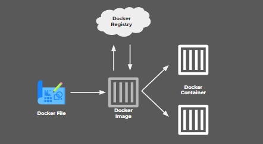

# Week 7 Writing Test

## Day 1(7/11/2022)

### **Lanjutan sequence** dari hari jumat minggu lalu

ORM atau Pbject Relational Mapping adalah teknik memetakan object perangkat lunak ke tabel database tanpa harus menulis query basis data apapun,orm juga mampu menduukung banyak database seperti Postgree,MYSQL,SQLite dsbnya

ORM terletak antara server dan database sehingga ia menghubungkan kedua hal tersebut,cara menggunakan sequelize ada 2 yaitu :

1. Tanpa Migration
   Jika tanpa menggunakan migration maka kita bisa melakukan install dengan mengikuti step yang ada pada [link ini](https://sequelize.org/docs/v6/getting-started/) yaitu dengan
   1. npm install --save sequelize
   2. npm install --save mysql2 (tergantung menggunakan db apa)
      untuk selanjutnya dapat dilihat di link yang sudah tercantum di atas
2. Dengan Migration
   Migration adalah menyimpan history perubahan pada table yaitu dengan cara setiap create/hapus/edit kolom otomatis disimpan perubahan dan bisa balik lagi ke versi tabel seebelumnya dengan menggunakan undo adapun untuk tahapan migration dapat melihat [Link ini](https://sequelize.org/docs/v6/other-topics/migrations/) pada writing test kali ini kami menggunakan dengan Migration.

Langkah menggunakan ORM dengan Migration

1. **npm install --save-dev sequelize-cli** (untuk melakukan install sequelize)
2. **npm install sequelize mysql2** (untuk menginstall database mysql)
3. **npx sequelize-cli init** (langkah ini dilakukan untuk membuat confid,models,migration dan seeders adapaun contoh file yang akan terbuat sebagai berikut)


> Penjelasan setiap file
>
> > - _config_ berfungsi untuk menghubungkan atau connecting ke database
> > - file _models_ berfungsi untuk merepresentasikan tabel yang ada di database jadi dika di model ada users maka di database ada tabel user termasuk di dalamnya berisi atribut.
> > - File migration berfungsi untuk melakukan migrasi ke database atau create database ke database ke my sql
> > - File seeders berfungsi untuk melakukan penambahan atau mengedit database dengan cara menggunakan async await dan [bulkInsert](https://sequelize.org/api/v6/class/src/dialects/abstract/query-interface.js~queryinterface)

_Lanjutan langkah menggunakan ORM_ 4. **Ubah pass,user hingga database sesuai kebutuhan anda** di development agar bisa terconnect,adapun contohnya sebagai berikut


5. Jika database tersebut belum dibuat maka,gunakanlah **npx sequelize db:create**,untuk mmebuat database tersebut

6. **npx sequelize model:create --name User --attributes name:string,email:string,password:string**,berfungsi untuk membuat tabel dengan nama User dan berisikan atribut name,email dan password dengan type data string ,perlu diketahui setelah kita selesai melakukan itu maka akan muncul file _user di model_ dan _create-user di migration_

7. Selanjutnya kita dapat melakukan **Npx sequelize db:migrate** Untuk koneksi database,dan dapat melakukan **npx sequelize db:migrate:undo** Jika ingin mengundo database

8. Kita dapat menambahkan data pada database dengan menggunakan query **Npx sequelize-cli seed:create –-name demo-user** demo user merupakan tabel yang ingin kita tambahkan,selanjutnya akan muncul file baru di seeder sebagai berikut :
   

9. Setelah itu aync await dan bulkinsert untuk membuat data baru seperti gambar diatas
10. Jika sudah maka **npx sequelize db:seed --seed 20221107074045-demo-user.js** untuk memasukkan data tersebut ke database sql atau basicnya sebagai berikut _npx sequelize db:seed --seed nama-file-seeder-nya_
11. Selanjutnya kita bisa mengatur di controller seperti gambar dibawah ini agar bisa diakses dengan localhost:port/user
    
    12.begitu seterusnya jika kita ingin menambahkan data/tabel atau menghapus hingga menampilkannya jika diminta oleh port

#### Associate

Associate atau yang biasa kita sebut relation berfungsi untuk menghubungkan satu tabel dengan tabel lainnya adapun beberapa argumen Association sebagai berikut :

- hasOne(one to one),perbedaan dengan belongsTo adalah kunci asing(FK) akan ditentukan pada model target dapat dilakukan dengn cara menambahkan kunci asing ke target dan mixin asosiasi tunggal ke sumbernya.

- belongsTo(one to one),dapat dilakukan dengan cara menambahkan kunci asing dan campuran asosiasi tunggal ke sumbernya.

- hasMany(one to many),dapat dilakukan dengan cara menambahkan kunci asing ke target dan campuran asosiasi jamak ke sumbernya.

- belongsToMany(Many to Many),dapat dilakukan dengan cara membuat asosiasi N:M dengan tabel gabungan dan menambahkan mixin asosiasi jamak ke sumbernya. Tabel persimpangan dibuat dengan sourceId dan targetId.

Contoh implementasi di project adalah siapkan FK terlebih dahulu di tabel yang ingin kita hubungkan,kita dapat merubahnya dibagian migration seperti dibawah ini :


Kita dapat mengetahui bahwasannya _user_id_ merupakan sebuah FK dari tabel user,selanjutnya kita ingin bahwa antara user-blog relasinya one-many maka kita letakkan hasMany pada tabel user dan belongsTo pada tabel blog seperti dibawah ini :

> **Penulisan association di tabel user**


> **Penulisan association di tabel blogs**


Adapun materi lebih lengkapnya mengenai associate dapat dilihat [disini](https://sequelize.org/api/v6/class/src/associations/base.js~association)

## Day 2 (8/11/2022) & Day 3 (9/11/2022)

### **Mongodb**

Mongo DB Adalah salah satu database no sql dan sering dipakai untuk aplikasi berbasis cloud big data maupun grid computing serta berorientasi dokumen lintas platform,karena berbasis no sql maka mongodb sangatlah berbeda dengan mysql adapun perbedaannya sebagai berikut :
| No | My sql | MongoDb |
| -- | :----: | :-----: |
| 1 | Data disimpan pada dokumen berbentuk JSON | Data disimpan dalam tabel dan baris |
| 2 | Dalam pembuatannya Perlu menentukan Scema | Dalam pembutannya perlu tabel dan kolom data |
| 3 | Mendukung operasi JOIN | Tidak mendukung operasi JOIN |
| 4 | Menggunakan SQL untuk kueri | Menggunakan Javascript untuk kueri |
| 5 | Data terstruktur dan membutuhkan database relational tradisional | Data tidak struktr dan tida relational |
| 6 | Cocok jika memprioritaskan keamanan | Cocok jika layanan sebagaian besar berbasis cloud |

#### Schema Mongodb

Desain scema mongoDB bekerja sangat berbeda dari desain scema relational seperi mysql,dengan desain ini maka mongodb :

- Tidak ada proses formal
- Tidak ada algoritma
- Tidak ada peraturan khusus

**Embedding vs Referencing**
Di dalam mongodb hanya memiliki dua pilihan yaitu dapat melakukan menyebatkan data secara langsung (embed) atau mereferensikan bagian data lain (Referencing) hal ini mirip dengan join di sql,adapun kelebihan dan kekurangan keduanya sebagai berikut :

**Embedding**

> Advantages
>
> > - Dapat mengambil informasi yang relevan hanya dalam satu query
> > - Semua Operasi CRUD pada satu dokumen sesuai dengan ACID

> Limitation
>
> > - Dokumen biasanya relatif besar oleh karena itu meningkatkan kinerja kueri dengan membatasi ukuran dokumen pada setiap kueri
> > - Dokumen di MongoDB memiliki batas ukuran sebesar 16MB,oleh karena itu jika terlalu banyak data maka berpotensi melebihi batas ukuran yang ada.

Contohnya sebagai berikut :


**Referencing**

> Advantage
>
> > - Mengurangi kemungkinan suatu dokumen mencapai batas ukuran 16 mb
> > - Mengurangi Jumlah duplikasi data

> Limitation
>
> > - untuk mengambil semua data dalam dokumen referensi minimal 2 query atau $lookup diperlukan utuk mengambil semua informasi

Contohnya sebagai berikut :


Selain ituu di mongodb juga terdapat relationship adapun type Relationship sebagai berikut

- One-to-one

  - key-value dilakukan embedded dalam dokumen
  - Contohnya adalah jika satu karyawan dapat bekerja di satu dan hany satu departemen

- One-to-Few

  - Biasanya dilakukan jika suatu data berhubungan ke data lainnya tetapi sedikit contohnya adaah people memiliki beberapa alamat rumah
    adapun contohnya codenya sebagai berikut :

  ```
  {
   "_id": "ObjectId('AAA')",
   "name": "Joe Karlsson",
   "company": "MongoDB",
   "twitter": "@JoeKarlsson1",
   "twitch": "joe_karlsson",
   "tiktok": "joekarlsson",
   "website": "joekarlsson.com",
   "addresses": [
       { "street": "123 Sesame St", "city": "Anytown", "cc": "USA" },
       { "street": "123 Avenue Q",  "city": "New York", "cc": "USA" }
   ]
  }
  ```

- One-to-many
  - berfungsi untuk menghubungkan satu dokumen dengan lainnya contohnya adalah dokumen product dengan dokumen parts yang berelasi one to many
  - adapun emnghubungkannya adalah menaruh banyak id Parts pada product,contohnya sebagai berikut :
  ```
  {
   "name": "left-handed smoke shifter",
   "manufacturer": "Acme Corp",
   "catalog_number": "1234",
   "parts": ["ObjectID('AAAA')", "ObjectID('BBBB')", "ObjectID('CCCC')"]
  }
  ```
- One-to-Squilions
  - Berfungsi jika setiap dokumen memiliki banyak subdokumen yang memungkin melebihi batas aturan yaitu 16mb,biasanya dipakai untuk sebuah host yang memiliki banyak message.
- Many-to-Many

  - Seperti namanya many-to-many,maka satu dokumen dapat terhubung dengan banyak dokumen lainnya begitu sebaliknya contohny adalah aplikasi listtodo atau hobi dsbnya
  - cara memasangkannya hampir sama dengan one-to-many hanya saja ini keduanya dapat mendapatkan banyak id pasangannya,adapun contoh codenya sebagai berikut :
    _Dokumen User_

  ```
  {
   "_id": ObjectID("AAF1"),
   "name": "Andi",
   "Hobys": [ObjectID("ADF9"), ObjectID("AE02"), ObjectID("AE73")]
  }
  ```

  _Dokumen Hoby_

  ```
  {
   "_id": ObjectID("ADF9"),
   "name": "Basket",
   "peserta": [ObjectID("AAF1"), ObjectID("BB3G")]
  }
  ```

#### CRUD

- Create
  Kita bisa menambahkan dokumen di mongodb dengan cara
  - db.collection.insertMany()
  - db.collection.insertOne()
    Contoh code :
  ```
     db.users.insertOne(
        {
           name : "Hafizh",
           age  : 20,
           status : "single"
        }
     )
  ```
- Read
  Yaitu kita bisa meminta isi dari dokumen dengan cara
  - db.collection.find()
    Selain itu kita bisa menerapkan filter atau where serta menentukan beberapa data yang ingin ditampilkan di sql seperti berikut
  ```
     db.users.find(
        { age : {$gt:20}}
     ).limit(5)
  ```
- Update
  Kita dapat melakukan modify pada data yang telah kita bat dengan cara

  - db.collection.updateOne()
  - db.collection.updatemany()
  - db.collection.replaceOne()
    Contoh code :

  ```
     db.users.updateMany(
        {age: {&lt:25}},
        {$set: {status : "married"}}
     )
  ```

  Dari code diatas kita dapat mengetahui bahwa age:25 adalah filter dan set: married merupakan updatenya,jadi semua yang berumur 25 maka diganti menjadi married

- Delete
  berfungsi untuk mengahapus dokumen dalam koleksi,adapun beberapa querynya sebagai berikut ini :
  - db.collection.deletOne()
  - db.collection.deletMany()
    contoh query :
  ```
     db.users.deleteMany(
        {status : "jomblo"}
     )
  ```

### **Mongoose**

Mongoose adalah sebuah Object Document Mapper(ODM).serta biasanya dipakai untuk mongodb,oleh karena itu mongoose harus bisa melakukan crud terhadap mongodb,adapun langkahnya sebagao berikut :

1. Setting project dengan cara
   ```
     npm init;
     npm install express mongoose
   ```
2. Setelah itu kita mmebuat server.js yang isinya

   ```
    const express = require("express");
    const mongoose = require("mongoose");
    const foodRouter = require("./routes/foodRoutes.js");

    const app = express();

    app.use(express.json());

      mongoose.connect(
      "mongodb+srv://madmin:<password>@clustername.mongodb.net/<dbname>?retryWrites=true&w=majority",
      {
      useNewUrlParser: true,
      useFindAndModify: false,
      useUnifiedTopology: true
      }
      );

      app.use(foodRouter);

      app.listen(3000, () => {
    console.log("Server is running...");
   ```

3. Setelah itu kita dapat membuat schema dengan membuat models food sebagai berikut :

   ```
       const mongoose = require("mongoose");

       const FoodSchema = new mongoose.Schema({
         name: {
           type: String,
           required: true,
           trim: true,
           lowercase: true,
         },
         calories: {
           type: Number,
           default: 0,
           validate(value) {
             if (value < 0) throw new Error("Negative calories aren't real.");
           },
         },
       });

       const Food = mongoose.model("Food", FoodSchema);

       module.exports = Food;
   ```
4. Setelah itu kita bisa membuat routes,dimulai dari read/get 

    ```
      const express = require("express");
      const foodModel = require("../models/food");
      const app = express();

      app.get("/foods", async (request, response) => {
        const foods = await foodModel.find({});

        try {
          response.send(foods);
        } catch (error) {
          response.status(500).send(error);
        }
      });

      module.exports = app;
    ```
5. membuat post atau data dokumen baru :
    ```
    app.post("/food", async (request, response) => {
      const food = new foodModel(request.body);

      try {
        await food.save();
        response.send(food);
      } catch (error) {
        response.status(500).send(error);
      }
    });

    ```
6. membuat update atau patch 
    ```
    app.patch("/food/:id", async (request, response) => {
      try {
        await foodModel.findByIdAndUpdate(request.params.id, request.body);
        await foodModel.save();
        response.send(food);
      } catch (error) {
        response.status(500).send(error);
      }
    });
    ```
7. Membuat delete
    ```
    app.delete("/food/:id", async (request, response) => {
      try {
        const food = await foodModel.findByIdAndDelete(request.params.id);

        if (!food) response.status(404).send("No item found");
        response.status(200).send();
      } catch (error) {
        response.status(500).send(error);
      }
    });

    ```

note : Semua crud ditaruh di dalam router
## Day 4 (10/11/12)

### **Docker**

Docker merupakan layanan yang mampu untuk mengemas dan menjalankan sebuah aplikasi dalam sebuah lingkungan yang terisolasi,docker berfungsi ketika ada user yang mengerjakan project di komputer A dan ingin melanjutkannya di komputer B tetapi antara dua komputer tersebut memiliki perbedaan pada OS,nah biasanya akan terjadi issue yang timbul,hal tersebutlah yang melatar belakangi munculnya Docker.

*Cara kerjanya* adalah Docker men-sharing kernel dari host OS serta melakukan atau membuat container suatu aplikasi agar dapat dijalankan dimana saja dan kapan saja serta bersifat terisolasi sehingga tidak terpengaruh oleh faktor luar.

**VM vs Docker**
| keterangan | Docker | VM |
| -- | :----: | :-----: |
| Boot-Time | Boot dalam beberapa detik | Butuh beberapa menit untuk booting |
| memory Efficiency | Tidak ada ruang yang dibutuhkan untuk virtualisasi(sedikit memorti) | Membutuhkan seluruh OS untuk dimuat sebelum memulai |
| Security | Jika satu aplikasi terinfeksi maka mampu meretas seluruh sistem host | Karena kemaanan berdiri sendiri maka lebih secure |

Summary : keduanya memiliki fungsi dan tupoksi masing-masing jadi tidak bisa dibandingkan,berdasarkan beberapa artikel yang saya baca,jika kita ingin memproduksi aplikasi maka lebih baik menggunakan VM tetapi jika ingin menguji aplikasi bisa menggunakan Docker.



gambar diatas merupakan gambaran singka fundamental dari docker adapun pengertian masing2 prosesnya adalah sebagai berikut :
- *Docker file*,merupakan bluprint untuk membuat image
- *image*,merupakan template untuk menjalankan container
- *container*,merupakan perjudutan dari image,perlu diketahui bahwa satu image dapat memiliki banyak container
- *Docker Registry*,berfungsi sebagai tempat untuk uploud/download image

Kita dapat melakukan inisiasi docker dengan mondowloadnya di desktop adapun link downloadnya [Click Disini](docs.docker.com/get-docker)

**perintah dasar docker**
- melihat image ``` $ docker images ```
- Download Images ``` $ docker pull [option] ```
- melihat Docker containe yang running ``` $ docker cotainer ls ```
- Membuat docker container ``` $ docker container create --name ```
- Mencari images ``` $ docker search name_find ```
- Menghapus container ``` $ docker container rm name ```
- mengetahui version docker ``` $ docker --version[option] ```
- Membuat container dari image ``` $ docker run [options] image [command] [arg...] ```
- melakukan push dari image/repo ke registry ``` $ docker push [option] ```


**Docker compose**
,Perlu diketahui bahwasannya kita dapat menjalankan lebih dari 1 container secara bersama-sama dan saling terhubung caranya adalah menjalankan perintah ``` docker-compose nama.file.yaml up```


